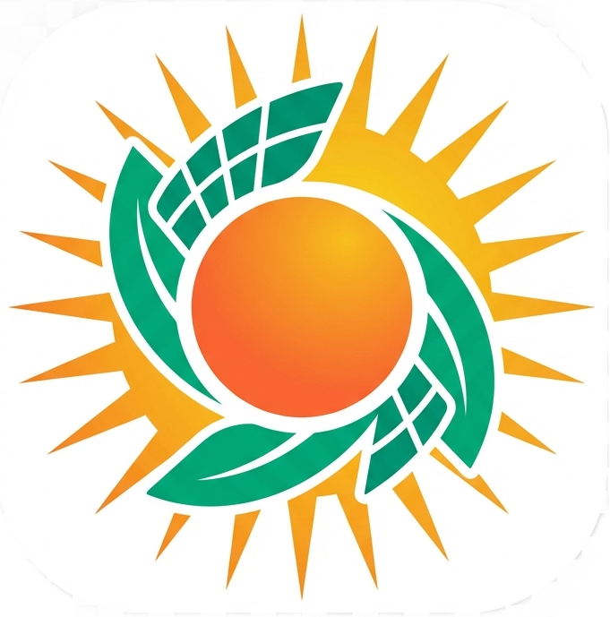

# Jua Smart - Branding Guidelines

## Brand Identity

**Jua Smart** is an intelligent solar energy advisor designed specifically for Kenya. The brand represents innovation, sustainability, clean energy, and empowerment through solar technology.

### Brand Values
- **Intelligent**: Data-driven, precise recommendations
- **Accessible**: Easy-to-understand solar solutions for everyone
- **Sustainable**: Commitment to clean, renewable energy
- **African**: Proudly serving Kenya with localized expertise
- **Trusted**: Reliable, accurate solar advisory

---

## Logo Usage

### Primary Logo


The primary logo features a stylized sun with geometric solar panel rays emanating outward, combined with the "Jua Smart" wordmark. Use this for headers, presentations, and primary branding.

**File**: `assets/logos/jua_smart_logo.png`

#### Logo Specifications
- **Format**: PNG with transparent background
- **Recommended width**: 300-800px for web use
- **Minimum size**: 150px width (to maintain legibility)
- **Clear space**: Maintain padding equal to the height of one sun ray on all sides

#### Usage Guidelines
✅ **DO:**
- Use on white or light backgrounds for maximum impact
- Center-align for headers and hero sections
- Maintain aspect ratio when resizing
- Ensure adequate contrast with background

❌ **DON'T:**
- Distort, stretch, or compress the logo
- Add drop shadows or effects
- Use on busy or low-contrast backgrounds
- Recreate or modify the logo elements

---

## Icon & Favicon

### Brand Icon



A simplified version of the logo featuring just the sun/solar burst symbol. Use for app icons, favicons, and small branding elements.

**Files**: 
- Icon: `assets/icons/jua_smart_icon.png`
- Favicon: `assets/icons/favicon.png`

#### Icon Specifications
- **Format**: PNG, square (1:1 ratio)
- **Size**: 512x512px (scales down effectively)
- **Usage**: Favicons, app tiles, social media avatars

---

## Color Palette

Our vibrant color scheme reflects the energy of the African sun and the innovation of clean technology.

### Primary Colors

| Color | Hex Code | Usage |
|-------|----------|-------|
| **Warm Orange** | `#FF6B35` | Primary brand color, CTAs, highlights |
| **Golden Yellow** | `#F7B801` | Accent color, energy indicators |
| **Emerald Green** | `#06A77D` | Success states, sustainability messaging |
| **Deep Blue** | `#004E89` | Trust, technology, secondary accents |

### Gradient

**Primary Gradient**: Orange to Yellow
```css
background: linear-gradient(135deg, #FF6B35 0%, #F7B801 100%);
```

This gradient represents sunrise and solar energy. Use for headers, hero sections, and emphasis elements.

### Neutral Colors

| Color | Hex Code | Usage |
|-------|----------|-------|
| **White** | `#FFFFFF` | Backgrounds, cards |
| **Light Gray** | `#F0F0F0` | Subtle backgrounds |
| **Medium Gray** | `#666666` | Body text, captions |
| **Dark Gray** | `#333333` | Headings, emphasis |

---

## Typography

### Primary Font
**SF Pro Display** / **Sans-serif fallback**

```css
font-family: 'SF Pro Display', -apple-system, BlinkMacSystemFont, 'Segoe UI', sans-serif;
```

### Font Weights
- **800 (Extra Bold)**: Main headers, brand name
- **600 (Semi-Bold)**: Subheaders, buttons, emphasis
- **400 (Regular)**: Body text
- **300 (Light)**: Captions, secondary text

### Type Scale
- **Hero/H1**: 3.5em (56px) - Main headers
- **H2**: 2.5em (40px) - Section headers
- **H3**: 1.5em (24px) - Subsections
- **Body**: 1em (16px) - Regular text
- **Caption**: 0.9em (14px) - Small text

---

## UI Components

### Cards
- **Background**: White (`#FFFFFF`)
- **Border Radius**: 15px
- **Shadow**: `0 4px 6px rgba(0,0,0,0.07)`
- **Border Left**: 4px solid `#FF6B35` (accent)
- **Hover**: Lift effect with `translateY(-5px)` and enhanced shadow

### Buttons
- **Primary**: Gradient background (orange to yellow), white text
- **Border Radius**: 10px
- **Font Weight**: 600
- **Hover**: Scale up to 102% with shadow

### Info Boxes
- **Info**: Purple gradient (`#667eea` to `#764ba2`)
- **Success**: Green gradient (`#06A77D` to `#05D9A5`)
- **Warning**: Orange-yellow gradient (`#F7B801` to `#FF6B35`)
- **Padding**: 20px
- **Border Radius**: 15px
- **Text Color**: White

---

## Brand Voice & Messaging

### Tone
- **Professional yet friendly**: Expert guidance without jargon
- **Empowering**: Helping users make informed decisions
- **Optimistic**: Emphasizing benefits and opportunities
- **Local**: Understanding Kenyan context and challenges

### Key Messages
- "Your Intelligent Solar Energy Advisor for Kenya"
- "Powered by Data, Designed for You"
- "Smart Solar Solutions for Every Kenyan"
- "From Sunlight to Savings"

### Terminology
- Use "solar potential" not "solar power"
- Use "energy independence" not "off-grid"
- Use "savings" and "return on investment" prominently
- Always specify "kWh" for energy, "KSh" for currency

---

## File Organization

```
assets/
├── logos/
│   └── jua_smart_logo.png          # Primary logo
├── icons/
│   ├── jua_smart_icon.png          # Square icon
│   └── favicon.png                 # Favicon
```

---

## Implementation Checklist

✅ **Completed:**
- [x] Custom logo with sun/solar panel design
- [x] Simplified icon for favicon and app use
- [x] Color palette established
- [x] App header updated with logo
- [x] Sidebar branded with icon
- [x] Favicon configured in Streamlit

📋 **Future Enhancements:**
- [ ] Social media banner (1200x630px)
- [ ] Email signature logo variant
- [ ] Print-ready logo (SVG/vector format)
- [ ] Dark mode logo variant
- [ ] Presentation template

---

## Contact & Support

For branding questions or additional assets:
- **GitHub**: https://github.com/Nemick
- **Version**: 2.1
- **Last Updated**: November 25, 2025

---

*Made with ☀️ in Kenya*
